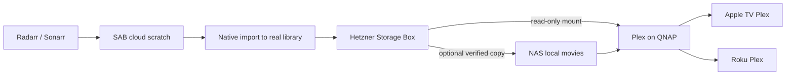

# Media workflow review — September 11, 2026

## Recommendation

Keep the existing Plex Media Server on the QNAP and the existing Plex Pass.
Use Radarr/Sonarr for library management, SABnzbd for acquisition, and rclone
or a supported network filesystem for storage access. Keep OliveTin only as a
transitional control for explicit NAS cache downloads/removals. It should not
be the main movie browser, completion processor, or playback interface.

The existing private Plex library remains separate from the new general
movie/TV libraries. Its home/search visibility was restricted, and a managed
everyday profile was created. Its media and library paths were preserved.
See [the deployed NAS/Plex layout](nas-plex-layout.md).

## What the standard tools already do

| Need | Appropriate tool | Consequence for our setup |
| --- | --- | --- |
| Find releases and choose quality | Radarr / Sonarr, indexers supplied by Prowlarr | Already enabled, including monitored RSS. |
| Download, repair, unpack | SABnzbd | Already working; keep downloads on local cloud scratch. |
| Import, name and track movie/episode files | Radarr / Sonarr Completed Download Handling | Enable after providing a real, consistently mounted library; current empty `/library` roots are insufficient. |
| Browse and watch on Apple TV / Roku | Existing QNAP Plex | Add libraries and restricted Home user; another media server is unnecessary for this separation. |
| Present remote files as readable storage | Read-only rclone mount or supported network mount on the Plex host | Plex reads regular filesystem paths, not our JSON manifests or raw indexer links. |
| Keep selected complete files on NAS | Existing verified rclone pull, or a small native transfer operation | Optional; remote playback does not require pre-copying the entire library. |
| Friendly discovery/requests later | Seerr, if desired | Standard Plex/Radarr/Sonarr integration, rather than a custom discovery UI. |

Radarr's official manual describes importing completed Usenet jobs into the
library, renaming them, and optional client cleanup. Remote Path Mappings only
translate paths; they do not transport data. Its Connect notifications can
trigger media-server updates after import. The target library must remain
visible to Radarr after cloud scratch is reclaimed, or it will again report
files missing. [Radarr settings](https://github.com/Servarr/Wiki/blob/master/radarr/settings.md)

SAB supports category-associated completion scripts and provides the job ID,
completed directory, and processing status. Those scripts also run on failures,
so any transport hook must check successful completion. If Radarr manages the
library, a SAB script must not move its files away before Radarr imports them.
A completion hook is a trigger, not a replacement for the storage transaction.
[SAB post-processing manual](https://sabnzbd.org/wiki/configuration/5.1/scripts/post-processing-scripts)

Seerr now combines the Overseerr/Jellyseerr projects and integrates Plex,
Radarr, and Sonarr. It is optional after import/playback works.
[Seerr manual](https://docs.seerr.dev/)

## Plex library and profile separation

Create separate libraries, for example `Movies — NAS`, `Movies — Remote`, and
corresponding TV libraries. Use distinct folders; do not point a new library
at the NAS share root or an existing private-media directory. Plex supports
multiple libraries and multiple source folders within a library, but separate
libraries make manual source selection explicit.
[Plex library creation](https://support.plex.tv/articles/200288926-creating-libraries/)

The `Movies & TV` Plex Home managed user now has access only to the new NAS
libraries. Use that identity on living-room clients. Protect the
owner/private profiles with a PIN. Hiding a sidebar entry or excluding search
recommendations is a presentation preference, not a replacement for library
permissions. Plex describes PINs as convenience controls, not strong account
security. For stronger isolation, a distinct Plex account shared only the new
libraries is another option.
[Managed accounts](https://support.plex.tv/articles/203948776-managed-users/),
[Plex Home setup](https://support.plex.tv/articles/204234323-creating-a-plex-home/)

Initially require profile selection on the TVs rather than automatically
returning to whichever user was last active. Roku's automatic-sign-in setting
can bypass the PIN for the selected profile. Only enable it after testing the
intended everyday profile and deciding whether someone might switch to the
owner profile on that device. Verify home recommendations, Continue Watching,
search, and a cold application launch on both Apple TV and Roku.
[Plex Roku settings](https://support.plex.tv/articles/204275243-settings-plex-for-roku/)

Jellyfin would provide a completely separate app/account boundary, but it adds
another server, metadata database, user system, and playback validation task.
It is not required merely to support multiple libraries. Jellyfin remains a
reasonable alternative if separate applications become a stronger preference.
[Jellyfin clients](https://jellyfin.org/downloads/clients/)

## Local and remote playback

Proposed topology (not yet deployed):

Keep Plex running at home. A Plex forum thread reproduces its 2023 notice
blocking servers at an affected provider, with Hetzner users reporting the
resulting failures. This is a hosting risk to avoid, not proof that storing
media on a Storage Box is prohibited. Our proposal uses Hetzner only as a
filesystem source for the existing home Plex server; it does not rely on a
Hetzner-hosted Plex server.
[Plex-hosted discussion and reproduced notice](https://forums.plex.tv/t/unauthorized-server/856704)

A read-only mount on the QNAP makes remote files available to Plex without
keeping full permanent NAS copies. A bounded read cache helps seeking; it does
not eliminate the need for sustained internet bandwidth. Local playback uses
the separate NAS library. Plex officially supports mounted network resources.
The precise QNAP mount integration still needs a read-only pilot before any
library migration.
[Plex network storage](https://support.plex.tv/articles/201122318-mounting-network-resources/),
[rclone mount](https://rclone.org/commands/rclone_mount/)

For the cloud library writer, evaluate Hetzner's supported SMB/CIFS mount or
SSHFS with the existing dedicated identity. Mount failure must not silently
redirect imports into an ordinary empty local directory. Do not treat a
write-cached rclone mount as immediate proof of off-host durability: pending
uploads and cache pressure need explicit handling. This mount/import pilot is
required before replacing the current verified publisher.
[Hetzner SMB/CIFS](https://docs.hetzner.com/storage/storage-box/access/access-samba-cifs/),
[Hetzner SSHFS automount tutorial](https://community.hetzner.com/tutorials/setup-autofs-mount-storagebox/),
[rclone VFS caching](https://rclone.org/commands/rclone_mount/#vfs-file-caching)

Plex can scan on filesystem changes and on a schedule. Network mounts typically
do not deliver reliable change notifications, so use native post-import
notifications plus scheduled scans as a fallback. Avoid removing library
metadata solely because a remote mount is temporarily unavailable.
[Plex library settings](https://support.plex.tv/articles/200289526-library/)

The QNAP is a TS-451D2 with a Celeron J4025 and 4 GB RAM according to our existing
inventory. The present downloads include 4K HEVC/HDR releases and lossless audio.
Test actual files on both devices before selecting final quality profiles:
unsupported video/audio/subtitles can require transcoding. Do not assume this
NAS can convert every 4K HDR file in real time. Infuse is an optional Apple TV
client if format compatibility warrants it, while Plex remains the shared
server and Roku client.
[Plex Roku 4K requirements](https://support.plex.tv/articles/214577427-is-4k-content-supported-on-the-roku/),
[Infuse capabilities](https://firecore.com/infuse)

## Current work and migration order

1. Address cloud disk pressure with the already deployed verified publisher.
   It processes successful SAB history entries, uploads with rclone, verifies
   bytes, publishes a manifest, and only then reclaims the source directory.
   Stable job IDs and receipts allow safe retries. Four completed movies were
   found and all four were published and cleaned successfully. Cloud free space
   increased from 55.1 GiB to 123.7 GiB. Three queued jobs were already paused;
   that pause is retained.
2. Keep the existing catalog usable during migration. Its backend refreshes every
   minute. The pinned OliveTin Vue dashboard does not reload dashboard data on
   configuration events, even though its event client refreshes Init. A small
   supported custom-JS compatibility fix reloads only an idle catalog page,
   avoiding forms and execution dialogs. Do not build a new browsing interface.
3. Pilot real mounted library access, native Radarr/Sonarr imports and Plex
   scans using a generated/public-domain fixture. The current publisher must
   be disabled for jobs handed to native import; two file movers must not own
   the same completed directory.
4. Separate NAS Plex libraries and the restricted everyday identity are deployed.
   Existing private files remain untouched. Test profile startup before normal use.
5. Test NAS and remote playback, seeking, audio and subtitles on Apple TV/Roku.
   Migrate the already published objects without redownloading their content.
6. Retire custom manifest presentation where Plex/Seerr supplies the user-facing
   function; retain only the transfer controls actually needed for selective
   offline NAS copies and verification.

Native import, remote playback mounts, and TV-client profile configuration
remain to be implemented or validated. NAS Plex libraries, server scanning,
private-library visibility and managed-profile grants are now configured.
